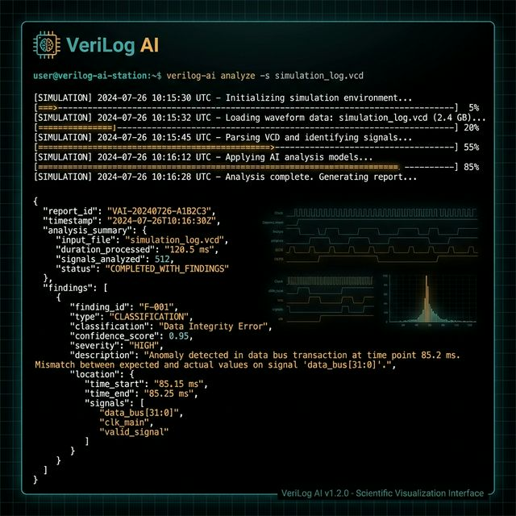

# VeriLog AI

> **AI-powered simulation log classifier for Digital IC Verification**
>
> Classifies Verilator/UVM simulation failures, provides root-cause explanations, and integrates into CI/CD verification flows — with built-in reliability guardrails.

[](https://www.python.org/downloads/)
[](https://fastapi.tiangolo.com/)
[](LICENSE)

---

---


## Table of Contents

- [Problem](#problem)
- [Solution](#solution)
- [Features](#features)
- [Project Status](#project-status)
- [Architecture](#architecture)
- [Quick Start](#quick-start)
- [Usage](#usage)
- [API Reference](#api-reference)
- [Configuration](#configuration)
- [Testing](#testing)
- [Docker](#docker)
- [Model Training](#model-training)
- [Evaluation & Metrics](#evaluation--metrics)
- [Project Structure](#project-structure)
- [Roadmap](#roadmap)
- [Contributing](#contributing)
- [Author](#author)

---

## Problem

Verification engineers spend **40–60% of their time** manually triaging simulation failures — reading thousands of log lines, pattern-matching against known bugs, and reasoning about root causes. Existing solutions are either:

- **Too generic:** LLM wrappers that hallucinate on domain-specific EDA errors
- **Too brittle:** grep/regex scripts that break on log format changes
- **Non-existent:** No labeled datasets exist for verification bug classification

## Solution

**VeriLog AI** solves this with a domain-specialized approach:

1. **Synthetic Data Pipeline** — Generates labeled training data via controlled RTL mutations with known ground-truth failure modes
2. **Fine-tuned LLM** — Classifies failures AND explains root causes (not just labels)
3. **Production Reliability** — Circuit-breaker pattern + confidence gating + rule-based fallback ensures the verification pipeline never blocks

## Features

### Implemented (Phase 1)

| Feature | Description |
|:---|:---|
| **CLI Classification** | Pipe a simulation log → get label + root-cause explanation + confidence score |
| **FastAPI REST API** | `/classify` endpoint with Pydantic schemas and auto-generated OpenAPI docs |
| **Circuit Breaker** | Automatic fallback to rule-based parser when model server is unavailable |
| **Confidence Gating** | Scores below threshold → "Unknown — Check Manually" (never guesses blindly) |
| **Mutation Engine** | 5 mutations (3 syntactic, 2 semantic) with Registry pattern for extensibility |
| **Inert Detection** | Behavioral hashing detects mutations that produce no observable change |
| **Structured Logging** | `TB_LOG|` format with assertion IDs, signal dumps, cycle numbers |
| **Evaluation Pipeline** | Automated accuracy/confusion metrics on JSONL datasets |
| **A/B Test Framework** | p50/p95 time-reduction calculator for manual vs. AI triage |
| **Metrics Dashboard** | Auto-generated markdown summary across all report artifacts |

### In Progress (Phase 2)

| Feature | Description |
|:---|:---|
| **Model Fine-tuning** | Training script ready; awaiting expanded dataset and GPU run |
| **Dataset Expansion** | Need 400+ samples across UART, SPI, GPIO modules |
| **Natural Bug Validation** | Need real OpenCores regression logs (current set is proxy) |

---

## Project Status

| Phase | Status | Key Metric |
|:---|:---|:---|
| Phase 1: Data Gen & Infrastructure | Complete | 5 mutations, 9 test files, full API |
| Phase 2: Model Training & Eval | In Progress | 40% accuracy (rule-based baseline) |
| Phase 3: Packaging & Docs | Not Started | Dockerfile exists, needs validation |
| Phase 4: Production Deployment | Not Started | See [Roadmap](#roadmap) |

---

## Architecture

```
┌─────────────────────────────────────────────────────────────────┐
│                      VeriLog AI System                          │
├─────────────────────────────────────────────────────────────────┤
│                                                                  │
│   CLI (Typer)  ──▶  FastAPI Gateway (:8000)  ──▶  Model Server  │
│                          │                        (:8001, HF)    │
│                          │                             │         │
│                          ▼                             ▼         │
│                   ┌──────────────┐            ┌──────────────┐   │
│                   │ Circuit      │            │ HuggingFace  │   │
│                   │ Breaker +    │  fallback  │ Pipeline     │   │
│                   │ Confidence   │◀───────────│ (flan-t5 /   │   │
│                   │ Gate         │            │  CodeLlama)  │   │
│                   └──────────────┘            └──────────────┘   │
│                          │                                       │
│                          ▼                                       │
│                   ┌──────────────┐                               │
│                   │ Rule-Based   │                               │
│                   │ Fallback     │                               │
│                   │ Classifier   │                               │
│                   └──────────────┘                               │
│                                                                  │
│   Data Pipeline:                                                 │
│   OpenCores RTL ──▶ Mutation Engine ──▶ Verilator ──▶ JSONL     │
│                                                                  │
└─────────────────────────────────────────────────────────────────┘
```

**Key Design Decisions:**
- **Two-service architecture**: API gateway and model server are separate, so models can be swapped without API changes
- **Graceful degradation**: If model server is down → circuit breaker opens → falls back to rule-based regex classifier
- **Confidence gating**: Scores `< 0.7` → `"Unknown"` label — the tool never guesses

---

## Quick Start

### Prerequisites

- Python 3.11+
- (Optional) Verilator 5.0+ for real simulation logs
- (Optional) CUDA GPU for model training

### Installation

```bash
# Clone the repository
git clone https://github.com/fadynabil/verilog-ai.git
cd verilog-ai

# Create virtual environment
python -m venv .venv
source .venv/bin/activate

# Install dependencies
pip install -r requirements.txt
```

### Generate Sample Data

```bash
# Without Verilator (uses synthetic logs)
python -m data.generate_dataset --no-sim

# With Verilator (real simulation — requires Verilator 5.0+)
python -m data.generate_dataset
```

---

## Usage

### CLI — Classify a Log File

```bash
# Classify a simulation log (rule-based, no model server needed)
python -m cli.main classify --log data/logs/counter_boundary_violation.log
```

**Output:**
```
label: Off-by-One Error
confidence: 0.85
explanation: Counter exceeded MAX_DEPTH; likely boundary condition in counter update.
```

### API — Start the Services

```bash
# Terminal 1: Start model server (optional — API falls back to rules without it)
python -m model.server

# Terminal 2: Start API gateway
uvicorn api.main:app --reload --port 8000
```

### API — Classify via REST

```bash
# Classify a log
curl -X POST http://localhost:8000/classify \
  -H "Content-Type: application/json" \
  -d '{"log": "ASSERT_FAIL: Counter overflow at cycle 23\nSimulation terminated..."}'

# Health check
curl http://localhost:8000/health
```

**Response:**
```json
{
  "label": "Off-by-One Error",
  "explanation": "Counter exceeded MAX_DEPTH; likely boundary condition in counter update.",
  "confidence": 0.85
}
```

---

## API Reference

### `POST /classify`

Classifies a simulation log and returns a label, explanation, and confidence score.

| Parameter | Type | Description |
|:---|:---|:---|
| `log` | string | The simulation log content to classify |

**Response:**
```json
{
  "label": "Off-by-One Error | Handshake Protocol Violation | Data Integrity Error | Unknown",
  "explanation": "Root-cause explanation string",
  "confidence": 0.85
}
```

**Behavior:**
- If confidence `< CONFIDENCE_THRESHOLD` (default 0.7) → label becomes `"Unknown"`
- If model server is down and `MODEL_SERVER_FALLBACK=1` → uses rule-based classifier
- If circuit breaker is OPEN → returns fallback immediately (no network call)

### `GET /health`

Returns service health and circuit breaker status.

```json
{
  "status": "ok",
  "circuit_state": "CLOSED",
  "circuit_failures": 0
}
```

---

## Configuration

All configuration is via environment variables:

| Variable | Default | Description |
|:---|:---|:---|
| `MODEL_SERVER_ENABLED` | `1` | `1` = use model server, `0` = rule-based only |
| `MODEL_SERVER_URL` | `http://localhost:8001` | Model server endpoint URL |
| `MODEL_SERVER_FALLBACK` | `1` | `1` = fallback to rules on error, `0` = fail closed (503) |
| `CONFIDENCE_THRESHOLD` | `0.7` | Confidence below this → `"Unknown"` |
| `CIRCUIT_FAILURE_THRESHOLD` | `5` | Consecutive failures before circuit opens |
| `CIRCUIT_RECOVERY_TIMEOUT_SEC` | `60` | Seconds before HALF_OPEN retry |
| `MODEL_NAME` | `google/flan-t5-small` | HuggingFace model ID for model server |

---

## Testing

```bash
# Run full test suite
pytest tests/ -v

# Run specific test categories
pytest tests/test_mutations.py -v        # Mutation engine tests
pytest tests/test_log_parser.py -v       # Log parser tests
pytest tests/test_api_reliability.py -v  # Circuit breaker + API tests
pytest tests/test_dashboard.py -v        # Dashboard generator tests
```

**Test Coverage:**

| Test File | Component | Tests |
|:---|:---|:---|
| `test_mutations.py` | Mutation engine, apply/sanitize | done |
| `test_log_parser.py` | Log parser (structured + unstructured) | done |
| `test_api_reliability.py` | Circuit breaker, fallback, confidence gate | done |
| `test_assertions_helpers.py` | Assertion generation helpers | done |
| `test_dataset.py` | Dataset generation pipeline | done |
| `test_dashboard.py` | Dashboard markdown rendering | done |
| `test_metrics_ab.py` | A/B test statistics | done |
| `test_natural_eval.py` | Natural bug evaluation | done |
| `test_verilator_integration.py` | Verilator simulation integration | Needs Verilator |

---

## Docker

```bash
# Build image
docker build -t verilog-ai:latest -f docker/Dockerfile .

# Run (rule-based mode — no model server)
docker run -p 8000:8000 -e MODEL_SERVER_ENABLED=0 verilog-ai:latest

# Health check
curl http://localhost:8000/health
```

**Image target:** <3 GB (measurement pending)

---

## Model Training

### Quick Training (flan-t5-small, CPU)

```bash
# Train on current dataset (5 samples — for pipeline validation only)
python -m model.train --dataset data/dataset.jsonl --max-steps 50

# Train with LoRA adapters
python -m model.train --dataset data/dataset.jsonl --use-lora --max-steps 200
```

### Full Training (CodeLlama-7B, GPU)

```bash
# Requires: Colab Pro or T4 GPU with 16GB VRAM
python -m model.train \
  --model-name codellama/CodeLlama-7B-Instruct-hf \
  --use-lora \
  --dataset data/dataset.jsonl \
  --max-steps 500 \
  --batch-size 4 \
  --output-dir artifacts/verilog-ai-model
```

### Training Output

Checkpoints and metrics are saved to `--output-dir`:
```
artifacts/verilog-ai-model/
├── config.json
├── model.safetensors (or adapter_model.safetensors for LoRA)
├── tokenizer.json
└── train_metrics.json
```

---

## Evaluation & Metrics

### Run Evaluation

```bash
# Evaluate on training set
python -m model.eval --dataset data/dataset.jsonl

# Evaluate on natural bugs
python -m model.natural_eval --dataset data/natural_bugs.jsonl

# Generate full dashboard
python -m metrics.dashboard
```

### Current Metrics (February 23, 2026)

| Metric | Value | Notes |
|:---|:---|:---|
| Classification Accuracy | 40% (2/5) | Rule-based only; no trained model yet |
| Natural Bug Accuracy | 100% (5/5) |  Proxy data — not real regression logs |
| A/B Time Reduction (p50) | 53.9% | Pilot data on simulated tasks |
| A/B Time Reduction (p95) | 50.0% | Pilot data on simulated tasks |

> **Note:** These metrics reflect the current rule-based fallback classifier only. Model fine-tuning is expected to significantly improve accuracy on diverse failure patterns.

### Report Artifacts

| Report | Path | Description |
|:---|:---|:---|
| Evaluation metrics | `reports/eval_report.json` | Accuracy, confusion matrix |
| Natural bug report | `reports/natural_bug_report.json` | Sanity check on real-world-like bugs |
| A/B test report | `reports/ab_test_report.json` | Time reduction statistics |
| A/B raw samples | `reports/ab_test_samples.json` | Individual task timings |
| Dashboard summary | `reports/dashboard_summary.md` | Aggregated markdown dashboard |

---

## Project Structure

```
Si-Vision/
├── api/                       # FastAPI gateway
│   ├── main.py               #   /classify, /health endpoints
│   ├── schemas.py            #   Pydantic request/response models
│   └── reliability.py        #   CircuitBreaker implementation
├── cli/                       # CLI interface
│   └── main.py               #   Typer CLI entry point
├── data/                      # Data pipeline
│   ├── generate_dataset.py   #   Mutation → Verilator → JSONL pipeline
│   ├── dataset.jsonl         #   Training dataset (5 samples)
│   └── natural_bugs.jsonl    #   Natural bug proxy set
├── mutations/                 # Mutation engine
│   ├── engine.py             #   MutationEngine + behavioral_hash
│   ├── registry.py           #   MutationRegistry (auto-registration)
│   ├── base.py               #   Abstract Mutation + MutationSpec
│   ├── utils.py              #   Guarded regex helpers
│   ├── tier1/                #   Syntactic mutations (3)
│   └── tier2/                #   Semantic mutations (2)
├── model/                     # ML pipeline
│   ├── train.py              #   Fine-tuning script (HF + LoRA)
│   ├── inference.py          #   Rule-based fallback classifier
│   ├── server.py             #   Model server (port 8001)
│   ├── client.py             #   httpx client for model server
│   ├── eval.py               #   Evaluation metrics
│   └── natural_eval.py       #   Natural bug evaluator
├── testbenches/               # Verification testbenches
│   ├── fifo_tb.sv            #   Golden FIFO testbench (SystemVerilog)
│   ├── assertions.py         #   Assertion helper generator
│   └── assertions.svh        #   Structured log macros
├── tests/                     # Test suite (9 test files)
├── metrics/                   # Observability
│   ├── dashboard.py          #   Dashboard generator
│   └── ab_test.py            #   A/B statistics calculator
├── reports/                   # Generated reports
├── docker/
│   └── Dockerfile            #   Production container
├── requirements.txt
├── pytest.ini
├── PRD.md                     # Product Requirements Document
└── README.md                  # This file
```

---

## Roadmap

###  Phase 1: Data Generation & Core Infrastructure (Complete)
- Mutation engine (5 mutations, 2 tiers)
- FIFO golden testbench with structured logging
- CLI tool + FastAPI gateway + model server
- Circuit breaker + confidence gating + fallback
- Evaluation pipeline + dashboard

###  Phase 2: Model Training & Evaluation (In Progress)
- [ ] Expand dataset to 400+ samples (UART, SPI, GPIO modules)
- [ ] Implement train/val/test split
- [ ] Run fine-tuning on flan-t5-small
- [ ] Source real OpenCores natural-bug regression logs
- [ ] Run A/B test with real/historical tasks
- [ ] (Optional) Fine-tune CodeLlama-7B with QLoRA

###  Phase 3: Packaging & Documentation
- [ ] Validate Docker image size (<3 GB) and runtime
- [ ] Create architecture diagram
- [ ] Capture dashboard screenshot
- [ ] Write `docker-compose.yml` for multi-service deployment
- [ ] Set up GitHub Actions CI/CD pipeline

###  Phase 4: Production Deployment
- [ ] Push Docker images to container registry
- [ ] Deploy to cloud VPS (DigitalOcean/Hetzner) or Cloud Run
- [ ] Configure Nginx + SSL
- [ ] Add API authentication + rate limiting
- [ ] Set up monitoring (Prometheus + Grafana)
- [ ] Schedule weekly evaluation cron job


---

## Contributing

1. Fork the repository
2. Create a feature branch (`git checkout -b feature/your-feature`)
3. Ensure tests pass (`pytest tests/ -v`)
4. Submit a pull request

**Code Style:**
- Python 3.11+ with type hints
- Follow existing patterns (Registry, dataclasses, etc.)
- Add tests for new mutations or parser patterns

---

## Author

**Fady Nabil** — AI Engineer

- Building domain-specialized AI tools for Digital IC Verification
- Focus: Data Pipeline Engineering, Model Fine-tuning, Production ML Systems

---

## License

MIT License — see [LICENSE](LICENSE) for details.
